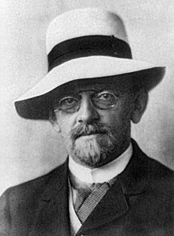
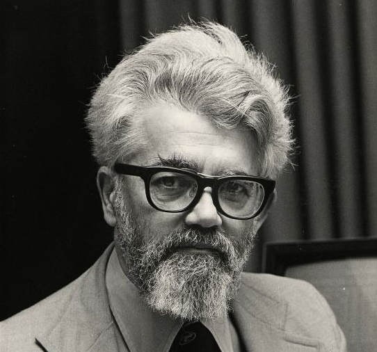

# 1986

---


---


---


---


---

# David Hilbert


---

# David Hilbert


---

# David Hilbert


---

# Kurt Gödel


---

# Kurt Gödel


---

#[fit] "This statement is not provable"

---

##[fit] Is the Entscheidungsproblem decidable?
##[fit] What is decidable?

---

# Alonzo Church


---

# Alonzo Church


---

# Kurt Gödel


---

# Kurt Gödel


---

# Alan Turing


---

# Alan Turing


---

#[fit] Church-Turing equivalence

---

# One problem, three equivalent solutions


---

# Lambda Calculus

```
L, M, N :=   x
        |    (lambda x. N)
        |    (L M)

```
---

# Booleans? If? Else? NUMBERS??


---

# Booleans

```
true x y =
     x

false x y =
     y
```

---

# If then else

```
ifte bool t e =
     bool t e

```

---

# And

```
and p q =
    p q p

and true false =
    true false true
    
and false true =
    false true false

```
...

---

# Or

```
or p q =
   p p q

or true false =
   true true false
   
or false false =
   false false false

```

---

# We can build any construct with lambda calculus

## But how do we encode numbers?

---

```

zero  f x = x
one   f x = f x
two   f x = f ( f x )
three f x = f ( f ( f x) )
...
```

<br>

```
> two (+1) 0
2
```

---

# Addition

```

add m n f x = m f (n f x)


> add one two (+1) 0
3
```
---

# Multiplication

```

mul m n f x = m (n f) x


> add one (mul two two) (+1) 0
5

```

---

# Remember, this is the 1940's
* Computers were actual people
* No compilers
* No programming language

---

# John McCarthy (1960's)



---

# LISP

```
(LABEL FACT (LAMBDA (N)
    (COND ((ZEROP N) 1)
        (T (TIMES N (FACT SUB1 N))))))
```

---

# 1960s - 1990s

* Lots of programming languages
* Many them were functional
* Little collaboration

---

# 1990s - Paul Hudak


---

# Haskell Curry


---

# Haskell (1990)


---

# Lazy evaluation

## The value is infinite

```haskell
> take 20 [1..]

[1,2,3,4,5,6,7,8,9,10,11,12,13,14,15,16,17,18,19,20]

```

---

# Mapping on inifite list

```haskell
> take 20 $ map (+1) [1..]

[2,3,4,5,6,7,8,9,10,11,12,13,14,15,16,17,18,19,20,21]

```
---

# All the iterations of a function

```haskell

iterate f x = [x, f x, f (f x), ...]

take 5 $ iterate (*3) 1

[1,3,9,27,81]

```
---

# Expressiveness

### How to model UI like this?

---

# Expressiveness

* Inifinite list of events
* Define functions to be applied to those events
* Result is an infinite list of side effects

---

# Elm

```haskell
lift : (a -> b) -> Signal a -> Signal b

lift isConsoant Keyboard.lastPressed

```

---

# Elm

```haskell

foldp : (a -> b -> b) -> b -> Signal a -> Signal b

foldp (\key count -> count + 1) 0 Keyboard.lastPressed

```

---

# Since Elm 0.17, there are no more signals

Farewell Functional Reactive Programming: [http://elm-lang.org/blog/farewell-to-frp](http://elm-lang.org/blog/farewell-to-frp)

---

# Elm Subscriptions

```haskell
subscriptions : Game -> Sub Msg
subscriptions model =
    Sub.batch
        [ AnimationFrame.diffs TimeUpdate
        , Keyboard.downs KeyDown
        , Time.every Time.second AskForTopPlayers
        , Time.every (Time.second * 2) GeneratePipe
        , Phoenix.Socket.listen model.phxSocket PhoenixMsg
        ]

```

---

# Elm Subscriptions

```haskell, [.highlight: 6]
subscriptions : Game -> Sub Msg
subscriptions model =
    Sub.batch
        [ AnimationFrame.diffs TimeUpdate
        , Keyboard.downs KeyDown
        , Time.every Time.second AskForTopPlayers
        , Time.every (Time.second * 2) GeneratePipe
        , Phoenix.Socket.listen model.phxSocket PhoenixMsg
        ]

```

---

# Elm Subscriptions

```haskell, [.highlight: 7]
subscriptions : Game -> Sub Msg
subscriptions model =
    Sub.batch
        [ AnimationFrame.diffs TimeUpdate
        , Keyboard.downs KeyDown
        , Time.every Time.second AskForTopPlayers
        , Time.every (Time.second * 2) GeneratePipe
        , Phoenix.Socket.listen model.phxSocket PhoenixMsg
        ]

```

---

# Elm

- Subscriptions generate messages
- User can generate messages (click button)
- State transformation through messages

---

# Elm 

````haskell
update : Msg -> Game -> ( Game, Cmd Msg )
update msg game =
    case game.state of
        Play ->
            case msg of
                AskForTopPlayers _ ->
                  ...
                SendScore ->
                  ...
                KeyDown keyCode ->
                  ...
                GeneratePipe _ ->
                  ...

````

---

# Elm

```haskell

view : Game -> Html Msg
view model =
    div []
        [ text (toString game) ]

```

---


---

# Summary

* Functional programming is invented, not discovered
* Are you using a programming language that is invented?
* Expressiveness by design

---

# Thank you

### Twitter: @paulodiniz
### Github: paulodiniz

