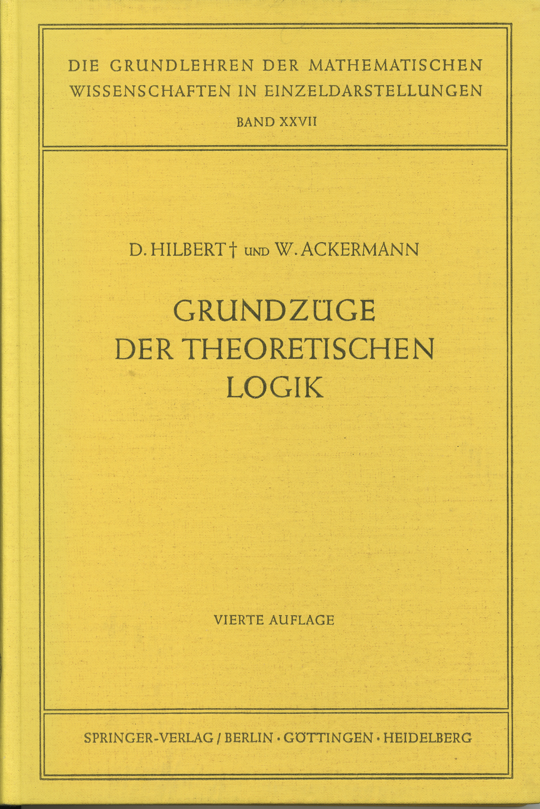
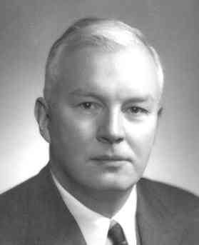

slidenumbers: true
# 1986

^ I did not know how to kickstart this talk, so I decided to kickstart from the year I was kickstarted. 1986. What was happening in 1986?

---


^ Halley comet will come in the 2061

---


^ First modular space station ever, and it was assembled in space.
^ Funny fact, they found mold on the air-conditioning equipment, which caused bad smell

---


^ Top Gun was the highest grossing movie of the year. Still one of my favourites, still cry when Goose dies

---


^ This is the TIOBE index for 1986, C is in the first position, Ada is on second, as LISP is in third.

^ Yay LISP! So how did this happen? Why does functional programming was big in 1986, and it's getting more and more attention now?

^ To try answering that, we have to go back a little bit in the past.

---

# David Hilbert


^ This is David Hilbert, a German mathematician from the early 1900s. He is one of the truly best that mankind has ever seen. What Hilbert wanted in the words of Philip Wadler was to "Put every mathematician out of business". 

---

# David Hilbert


^ He wanted an algorithm that could take any statement in formal logic as input, and the output would be if that statement is true or false. This is known as the "Decision Problem". For that to happen, Hilbert depended on one thing: that every provable statement is true, and that every non provable statement is false.
^ In other words, he needed that math itself was complete and consistent

---

# David Hilbert


^ He used to say "There is no such thing as an unsolvable problem" and the believed that so much that the epitath on his grave reads: We must know, we will know

---

# Kurt Gödel


^ What happened next? This man came along. This is Kurt Godel, another German mathematician. And in the 1930's he published a proof of his incompleteness theorem.

---

# Kurt Gödel


^ The incompleteness theorem states that any system powerful enough to express arithmetic is either incomplete or inconsistent. He did that by assigning numbers to operations on a system called Godel numbering.

---

#[fit] "This statement is not provable"

^ With that, he was able the encode the following statement. Is this true or false?
^ Well, if it's false, than you just proved something that is false, and the universe explodes. (inconsistent)
^ If it's true, you have a statement that is true, but you cannot prove it (incomplete)

---

##[fit] Is the Entscheidungsproblem decidable?
##[fit] What is decidable?

---

# Alonzo Church


^ In the 1930's, this man, Alonzo Church was working on Lambda Calculus

---

# Alonzo Church


^ And in 1936 he showed that if Decidable (or computable), was something you could express in lambda calculus, than yes, the enteisschuldngproblem was undecidable

---

# Kurt Gödel


^ Church presented his proof to Godel, which thought it was very unsatisfactory and decided he could derive his own proof.

---

# Kurt Gödel


^ So he did, In 1936 he derired the idea of 

---

# Alan Turing


---

# Alan Turing


---

#[fit] Church-Turing equivalence

---

# One problem, three equivalent solutions


---

# Lambda Calculus

```
L, M, N :=   x
        |    (lambda x. N)
        |    (L M)

```
---

# Booleans? If? Else? NUMBERS??


---

# Booleans

```
true x y =
     x

false x y =
     y
```

---

# If then else

```
ifte bool t e =
     bool t e

```

---

# And

```
and p q =
    p q p

and true false =
    true false true
    
and false true =
    false true false

```
...

---

# Or

```
or p q =
   p p q

or true false =
   true true false
   
or false false =
   false false false

```

---

# We can build any construct with lambda calculus

## But how do we encode numbers?

---

```

zero  f x = x
one   f x = f x
two   f x = f ( f x )
three f x = f ( f ( f x) )
...
```

<br>

```
> two (+1) 0
2
```

---

# Addition

```

add m n f x = m f (n f x)


> add one two (+1) 0
3
```
---

# Multiplication

```

mul m n f x = m (n f) x


> add one (mul two two) (+1) 0
5

```

---

# Remember, this is the 1940's
* Computers were actual people
* No compilers
* No programming language

---

# John McCarthy (1960's)


---

# LISP

```
(LABEL FACT (LAMBDA (N)
    (COND ((ZEROP N) 1)
        (T (TIMES N (FACT SUB1 N))))))
```

---

# 1960s - 1990s

* Lots of programming languages
* Many them were functional
* Little collaboration

---

# 1990s - Paul Hudak


---

# Haskell Curry



---

# Haskell (1990)


---

# Lazy evaluation

## The value is infinite

```haskell
> take 20 [1..]

[1,2,3,4,5,6,7,8,9,10,11,12,13,14,15,16,17,18,19,20]

```

---

# Mapping on inifite list

```haskell
> take 20 $ map (+1) [1..]

[2,3,4,5,6,7,8,9,10,11,12,13,14,15,16,17,18,19,20,21]

```
---

# All the iterations of a function

```haskell

iterate f x = [x, f x, f (f x), ...]

take 5 $ iterate (*3) 1

[1,3,9,27,81]

```
---

# Expressiveness

### How to model UI like this?

---

# Expressiveness

* Inifinite list of events
* Define functions to be applied to those events
* Result is an infinite list of side effects

---

# Advantages

* No callbacks
* Pure functions
* Handling time variant instead of event based

---

# Elm

```haskell
lift : (a -> b) -> Signal a -> Signal b

lift isConsonant Keyboard.lastPressed

```

---

# Elm

```haskell

foldp : (a -> b -> b) -> b -> Signal a -> Signal b

foldp (\key count -> count + 1) 0 Keyboard.lastPressed

```

---

# Since Elm 0.17, there are no more signals

Farewell Functional Reactive Programming: [http://elm-lang.org/blog/farewell-to-frp](http://elm-lang.org/blog/farewell-to-frp)

---

# Let's build a Flappy Bird game

* Generate pipes every X seconds
* Handle the key pressed event
* Handle colision
* Have a live scoreboard

---

# Elm Subscriptions

* Replacement of Signals
* Applying functions on infinite streams
* Generate messages

---

# Elm Subscriptions

```haskell
subscriptions : Game -> Sub Msg
subscriptions model =
    Sub.batch
        [ AnimationFrame.diffs TimeUpdate
        , Keyboard.downs KeyDown
        , Time.every Time.second AskForTopPlayers
        , Time.every (Time.second * 2) GeneratePipe
        , Phoenix.Socket.listen model.phxSocket PhoenixMsg
        ]

```

---

# Elm Subscriptions

```haskell, [.highlight: 6]
subscriptions : Game -> Sub Msg
subscriptions model =
    Sub.batch
        [ AnimationFrame.diffs TimeUpdate
        , Keyboard.downs KeyDown
        , Time.every Time.second AskForTopPlayers
        , Time.every (Time.second * 2) GeneratePipe
        , Phoenix.Socket.listen model.phxSocket PhoenixMsg
        ]

```

---

# Elm Subscriptions

```haskell, [.highlight: 7]
subscriptions : Game -> Sub Msg
subscriptions model =
    Sub.batch
        [ AnimationFrame.diffs TimeUpdate
        , Keyboard.downs KeyDown
        , Time.every Time.second AskForTopPlayers
        , Time.every (Time.second * 2) GeneratePipe
        , Phoenix.Socket.listen model.phxSocket PhoenixMsg
        ]

```

---

# Elm

- Subscriptions generate messages
- User can generate messages (click button)
- State transformation through messages

---

# Elm 

````haskell
update : Msg -> Game -> ( Game, Cmd Msg )
update msg game =
    case game.state of
        Play ->
            case msg of
                AskForTopPlayers _ ->
                  ...
                SendScore ->
                  ...
                KeyDown keyCode ->
                  ...
                GeneratePipe _ ->
                  ...

````

---

# Elm

```haskell

view : Game -> Html Msg
view model =
    div []
        [ text (toString game) ]

```

---


---

# Summary

* Functional programming is invented, not discovered
* Are you using a programming language that is invented?
* Expressiveness by design

---

# Thank you

### Twitter: @paulodiniz
### Github: paulodiniz

